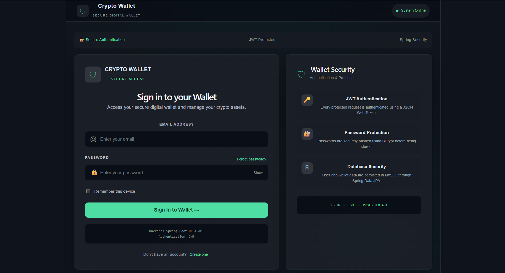
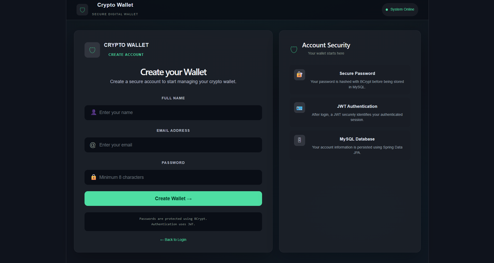
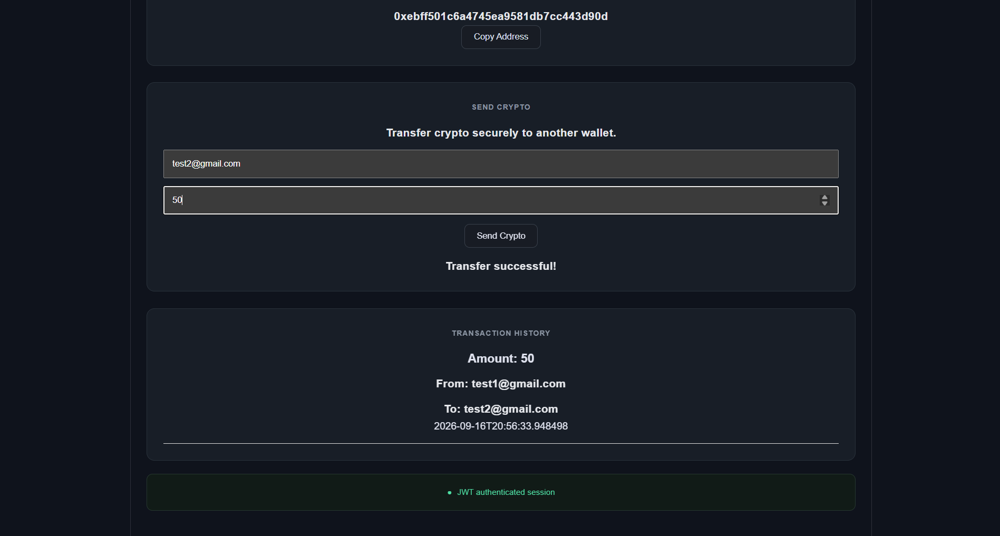

# Crypto Wallet Management System

A full-stack cryptocurrency wallet management system built using
React, Spring Boot, Spring Security, JWT and MySQL.

## Features

- User Registration and Login
- JWT Authentication
- Secure Password Encryption
- Wallet Creation
- Wallet Balance Management
- Send Crypto
- Receive Crypto using QR Code
- Wallet Address Generation
- Transaction History
- Protected REST APIs

## Tech Stack

Frontend:
- React
- Vite
- JavaScript
- CSS

Backend:
- Java 17
- Spring Boot
- Spring Security
- JWT
- Spring Data JPA
- Hibernate
- Maven

Database:
- MySQL

## Architecture

React Frontend
       ↓
REST API
       ↓
Spring Security + JWT
       ↓
Service Layer
       ↓
Repository Layer
       ↓
MySQL

## Project Structure

crypto-wallet/
├── backend/
└── frontend/

## How to Run

### Backend

cd backend
mvn spring-boot:run

Backend runs on:
http://localhost:4040

### Frontend

cd frontend
npm install
npm run dev

Frontend runs on:
http://localhost:5173

## API Features

Authentication
- POST /api/auth/signup
- POST /api/auth/login

Wallet
- GET /api/wallets
- POST /api/wallets/transfer
- GET /api/wallets/transactions

## Security

- JWT-based authentication
- Spring Security
- BCrypt password hashing
- Protected wallet APIs
## Screenshots

### Login Page

### Registration Page

### Wallet Dashboard

### Send Crypto & Transaction History

## Note
This project simulates cryptocurrency wallet transactions
using a Spring Boot backend and MySQL database.
It is not connected to a real blockchain network.
